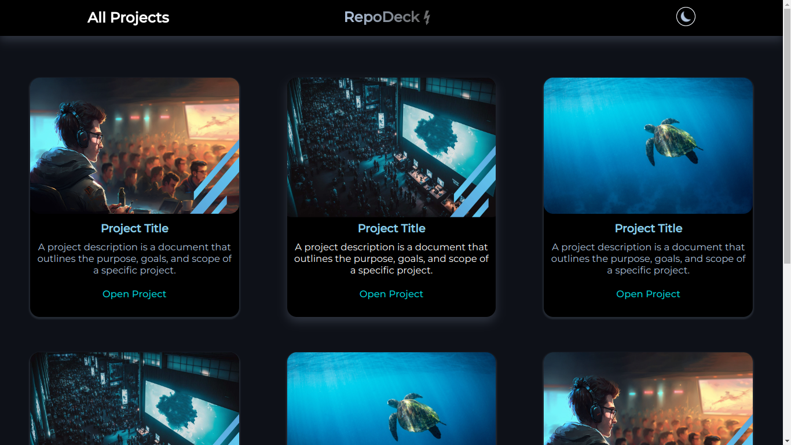

## RepoDeck ⚡


#### [DEMO LINK:](https://ironicbat7.github.io/WebDev-miniPROJECTS/RepoDeck/)
✨ https://ironicbat7.github.io/WebDev-miniPROJECTS/RepoDeck/


### Technologies Used

```JavaScript```  ```HTML``` ```CSS```


### Description

- Modern and elegant design.

- Dark mode option that toggles the color scheme of the webpage.

- Responsive layout that adapts to different screen sizes and devices.

- Visually appealing cards that showcase image, title, descripton.


### Screenshot



## License
[MIT License](LICENSE)

#### [Github Profile](https://github.com/iRONiCBAT7)

