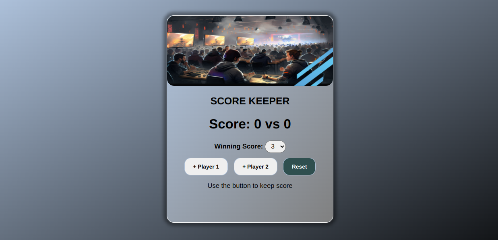

## ScoreKeeper

#### [DEMO LINK:](https://ironicbat7.github.io/WebDev-miniPROJECTS/ScoreKeeper/)
https://ironicbat7.github.io/WebDev-miniPROJECTS/ScoreKeeper/

### Technologies Used

```JavaScript```  ```HTML``` ```CSS```

### Description
- Choose winning score.
- Count and Keep the score
- It counts upto the winning score.
- Gives prompt of winner player.

### Screenshot


---

### Credits

- I created this with some changes.
- It was part of udemy Web Dev course by [Colt Steele](https://github.com/Colt)

--- 

#### [Github Profile](https://github.com/iRONiCBAT7)

